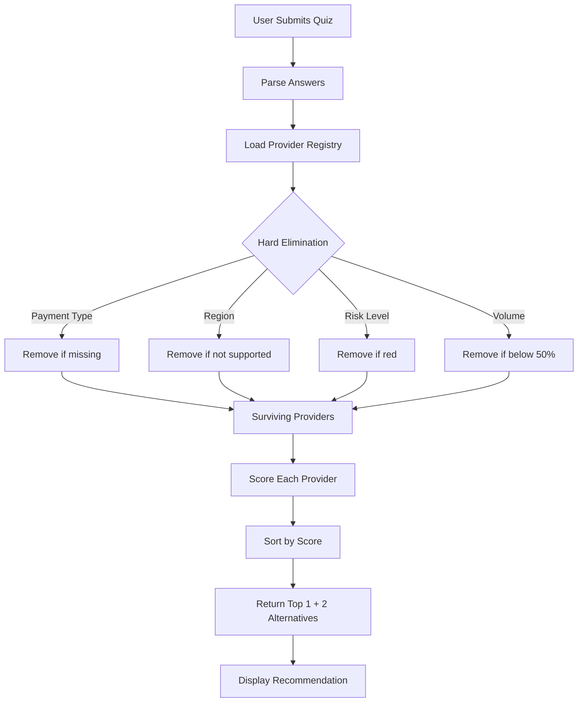

# ChosePayments - Product Requirements Document

## Overview

**Product:** ChosePayments  
**Domain:** chosepayments.co.uk  
**Purpose:** Help UK and US businesses find the optimal payment provider through an intelligent quiz and recommendation engine  
**Business Model:** Lead generation - capture qualified leads and connect them with payment providers

---

## Tech Stack

| Layer | Technology |
|-------|------------|
| Frontend | React 18, TypeScript, Vite |
| Styling | Tailwind CSS, shadcn/ui |
| Routing | React Router v6 |
| Backend | Lovable Cloud (Edge Functions) |
| Email | Resend API |
| Fonts | DM Sans |

---

## Core Features

### 1. Payment Provider Quiz (`/quiz`)

A 9-question wizard that collects:

| Step | Question | Key Data Collected |
|------|----------|-------------------|
| 1 | Where do you sell? | Sales channel (online/in-person/both) |
| 2 | Terminal type (if in-person) | Portable/countertop/mobile |
| 3 | Business type | Industry category |
| 4 | Location | UK or US |
| 5 | Monthly volume | Revenue tier |
| 6 | Top priority | Easy setup / Low fees / Scalability / International |
| 7 | Features needed | Multi-select capabilities |
| 8 | Contact preference | Time of day |
| 9 | Contact details | Name, email, phone, business name |

**Key Files:**
- `src/pages/Quiz.tsx` - Quiz UI and flow logic
- `src/lib/recommendationLogic.ts` - Client-side fallback

---

### 2. Recommendation Engine

**Server-side:** `supabase/functions/quiz-recommendation/index.ts`  
**Client fallback:** `src/lib/recommendationLogic.ts`

---

## Provider Registry

### Complete Provider List

| ID | Provider | Payment Types | Terminal | Marketplace | Regions | Min Volume |
|----|----------|---------------|----------|-------------|---------|------------|
| stripe | Stripe | card, bank, wallet | ✗ | ✓ | UK, US, EU | £0 |
| square | Square | card, wallet | ✓ | ✗ | UK, US | £0 |
| paypal | PayPal | card, bank, wallet | ✗ | ✗ | UK, US, EU | £0 |
| adyen | Adyen | card, bank, wallet | ✓ | ✓ | UK, US, EU | £50k |
| worldpay | Worldpay | card, bank | ✓ | ✗ | UK, EU | £10k |
| sumup | SumUp | card | ✓ | ✗ | UK, EU | £0 |
| zettle | Zettle | card | ✓ | ✗ | UK, EU | £0 |
| braintree | Braintree | card, bank, wallet | ✗ | ✓ | UK, US, EU | £0 |
| checkout | Checkout.com | card, bank, wallet | ✗ | ✓ | UK, US, EU | £25k |
| mollie | Mollie | card, bank, wallet | ✗ | ✗ | UK, EU | £0 |
| gocardless | GoCardless | bank | ✗ | ✗ | UK, EU | £0 |
| klarna | Klarna | bnpl | ✗ | ✗ | UK, US, EU | £5k |
| clearpay | Clearpay | bnpl | ✗ | ✗ | UK | £0 |
| revolut | Revolut Business | card, bank | ✓ | ✗ | UK, EU | £0 |
| wise | Wise Business | bank | ✗ | ✗ | UK, US, EU | £0 |
| airwallex | Airwallex | card, bank | ✗ | ✓ | UK, US, EU | £10k |
| rapyd | Rapyd | card, bank, wallet | ✗ | ✓ | UK, US, EU | £25k |
| ayden_pos | Adyen POS | card | ✓ | ✗ | UK, US, EU | £50k |
| fiserv | Fiserv (Clover) | card | ✓ | ✗ | US | £0 |
| authorize | Authorize.Net | card, bank | ✗ | ✗ | US | £0 |
| datman | Datman | card, bank | ✓ | ✓ | UK | £0 |
| opp | OPP | card, bank | ✓ | ✓ | UK | £0 |

---

## Industry Risk Matrix

Each provider has a risk appetite per industry: **green** (accepts), **amber** (case-by-case), **red** (declines)

| Provider | ecommerce | retail | hospitality | marketplace | saas | travel | gambling | adult | crypto | cbd | firearms |
|----------|-----------|--------|-------------|-------------|------|--------|----------|-------|--------|-----|----------|
| Stripe | 🟢 | 🟢 | 🟢 | 🟢 | 🟢 | 🟡 | 🔴 | 🔴 | 🔴 | 🔴 | 🔴 |
| Square | 🟢 | 🟢 | 🟢 | 🔴 | 🟢 | 🟡 | 🔴 | 🔴 | 🔴 | 🔴 | 🔴 |
| PayPal | 🟢 | 🟢 | 🟢 | 🟢 | 🟢 | 🟡 | 🔴 | 🔴 | 🔴 | 🔴 | 🔴 |
| Adyen | 🟢 | 🟢 | 🟢 | 🟢 | 🟢 | 🟢 | 🟡 | 🔴 | 🔴 | 🔴 | 🔴 |
| Worldpay | 🟢 | 🟢 | 🟢 | 🟢 | 🟢 | 🟢 | 🟡 | 🔴 | 🔴 | 🔴 | 🔴 |
| Datman | 🟢 | 🟢 | 🟢 | 🟢 | 🟢 | 🟢 | 🟡 | 🟡 | 🟡 | 🟡 | 🔴 |
| OPP | 🟢 | 🟢 | 🟢 | 🟢 | 🟢 | 🟢 | 🟡 | 🟡 | 🟡 | 🟡 | 🔴 |

**Legend:** 🟢 Green (accepts) | 🟡 Amber (case-by-case) | 🔴 Red (declines)

---

## Scoring Algorithm

### Step 1: Hard Elimination

Providers are **removed** from consideration if:

| Rule | Description |
|------|-------------|
| Missing Payment Type | Provider doesn't support required payment method |
| Region Mismatch | Provider doesn't operate in user's region |
| Red Risk Level | Provider has "red" risk for user's industry |
| Hard Exclusion | Provider explicitly excludes user's business type |
| Volume Too Low | User's volume is below 50% of provider's minimum |

### Step 2: Scoring (Surviving Providers)

#### Base Score
All providers start with **50 points**

#### Business Model Fit (up to +65 points)

| Condition | Points |
|-----------|--------|
| Needs marketplace + provider supports it | +30 |
| Needs split payments + provider supports it | +25 |
| Needs subscriptions + provider supports it | +10 |
| Needs marketplace but provider doesn't support | -20 |

#### Channel Fit (up to +25 points)

| Condition | Points |
|-----------|--------|
| In-person channel + provider has terminals | +15 |
| Online channel + provider is online-focused | +10 |
| In-person needed but no terminal support | -15 |

#### Volume Alignment (up to +10 points)

| Condition | Points |
|-----------|--------|
| Volume ≥ provider minimum | +10 |
| Volume is 50-100% of minimum | +5 |

#### Priority Alignment (up to +65 points)

| Priority | Matching Strength | Points |
|----------|-------------------|--------|
| easy_setup | Provider has "quick setup" strength | +20 |
| low_fees | Provider has "competitive rates" strength | +20 |
| scalability | Provider has "enterprise scale" strength | +15 |
| international | Provider supports 3+ regions | +10 |

#### Risk Comfort (±10 points)

| Risk Level | Points |
|------------|--------|
| Green | +10 |
| Amber | 0 |
| Red | -5 (shouldn't reach here due to elimination) |

#### Special Bonuses (up to +35 points)

| Condition | Points |
|-----------|--------|
| OPP provider + high-risk industry | +25 |
| Datman provider + UK region | +10 |
| Strong regional match | +5 |

---

## Example Scoring Walkthrough

**Quiz Answers:**
- Sales channel: Online only
- Business type: Marketplace
- Location: UK
- Monthly volume: £25,000
- Priority: Scalability
- Features: Split payments, Multi-currency

**Step 1: Elimination**
- ❌ Square - No marketplace support
- ❌ SumUp - No marketplace support
- ❌ Zettle - No marketplace support
- ✅ 15 providers remain

**Step 2: Scoring (Top 3)**

| Provider | Base | Marketplace | Splits | Channel | Volume | Priority | Risk | Bonus | Total |
|----------|------|-------------|--------|---------|--------|----------|------|-------|-------|
| Stripe | 50 | +30 | +25 | +10 | +10 | +15 | +10 | 0 | **150** |
| Adyen | 50 | +30 | +25 | +10 | 0 | +15 | +10 | 0 | **140** |
| Braintree | 50 | +30 | +25 | +10 | +10 | +10 | +10 | 0 | **145** |

**Result:** Stripe (primary), Braintree (alt 1), Adyen (alt 2)

---

## Client-Side Fallback Logic

`src/lib/recommendationLogic.ts` provides simpler rule-based recommendations when server is unavailable:

### UK Logic Flow
```
IF marketplace → Datman or Adyen
IF in-person only → Square or SumUp
IF high volume (>£50k) → Adyen
IF priority = easy_setup → Square
IF priority = low_fees → SumUp or Stripe
DEFAULT → Stripe
```

### US Logic Flow
```
IF marketplace → Stripe
IF in-person only → Square or Clover
IF high volume → Stripe or Fiserv
DEFAULT → Stripe
```

---

## Lead Capture & Email System

### Lead Flow
1. User completes quiz
2. Form captures: name, email, phone, business name
3. Enrichment data attached (UTM, referrer, session)
4. Two emails sent:
   - **Lead notification** → business team
   - **Confirmation** → user

### Edge Functions

| Function | Purpose |
|----------|---------|
| `quiz-recommendation` | Scores providers, returns recommendation |
| `send-lead-email` | Notifies team of new lead |
| `send-confirmation-email` | Thanks user for inquiry |

### Security
- HTML sanitization on all inputs
- Rate limiting (3 emails/minute/IP)
- No raw SQL execution

---

## Content Hub (Insights)

### Structure

```
/insights                    → Hub page
├── /insights/payment-risk   → Category: Why accounts get flagged
├── /insights/guides         → Category: Practical how-to guides
└── /insights/case-studies   → Category: Coming soon
```

### Articles (18 total)

**Payment Risk Category:**
- Why Payment Accounts Get Flagged Without Changes
- Why Payment Accounts Get Flagged After Growth
- Why Accounts Are Frozen Without Warning
- Why Providers Re-Underwrite Existing Accounts
- Why Some Businesses Are Never Approved
- Why Stripe Freezes Accounts
- Why Marketplaces Get Extra Scrutiny

**Guides Category:**
- Proof of Business Activity
- Sales Increase Documentation
- Marketplace Seller Info
- Source of Funds
- Industry Verification
- International Sales
- Contracts and Invoices
- Director Documents
- Source of Funds (detailed)

---

## SEO Landing Pages

| Route | Purpose |
|-------|---------|
| `/` | UK Homepage |
| `/us` | US Homepage |
| `/stripe-vs-square-vs-paypal-uk` | Comparison |
| `/best-payment-processor-uk` | Best processor |
| `/best-payment-api-uk` | Best API |
| `/stripe-alternatives` | Alternatives |
| `/hidden-fees` | Fee transparency |
| `/switch-provider` | Switching guide |
| `/small-business` | SMB focus |
| `/marketplace-platforms` | Marketplace focus |
| `/support-matters` | Support comparison |
| `/choose-provider` | Decision guide |
| `/about` | Company info |

---

## Environment & Secrets

| Variable | Source | Purpose |
|----------|--------|---------|
| `VITE_SUPABASE_URL` | Auto | API endpoint |
| `VITE_SUPABASE_PUBLISHABLE_KEY` | Auto | Client auth |
| `RESEND_API_KEY` | Manual | Email sending |

---

## File Reference

| Purpose | File |
|---------|------|
| Quiz UI | `src/pages/Quiz.tsx` |
| Recommendation page | `src/pages/Recommendation.tsx` |
| Client fallback | `src/lib/recommendationLogic.ts` |
| Server engine | `supabase/functions/quiz-recommendation/index.ts` |
| Lead form | `src/components/LeadCaptureForm.tsx` |
| Lead email | `supabase/functions/send-lead-email/index.ts` |
| Confirmation email | `supabase/functions/send-confirmation-email/index.ts` |
| Insights hub | `src/pages/Insights.tsx` |
| Enrichment data | `src/hooks/useEnrichmentData.ts` |
| SEO hook | `src/hooks/useSEO.ts` |
| Sitemap | `public/sitemap.xml` |
| Design tokens | `src/index.css`, `tailwind.config.ts` |

---

## Current State

- **Database tables:** None (stateless lead capture)
- **Authentication:** None required
- **Indexed URLs:** 28 in sitemap
- **Favicon:** `favicon.png`

---

## Algorithm Flow Diagram


